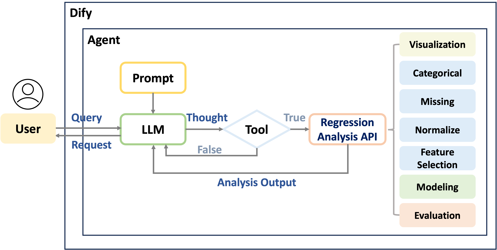

# Regression Model for Multi-Task
Automate a variety of data analysis processes with a generic regression model. This model is designed to streamline the entire workflow from data preprocessing to model evaluation and visualization, making it suitable for multiple regression tasks.

## Pipeline
**Regression Analysis Workflow**  

    

---

**Integration with LLM**

 

---
```  
Regression Analysis
    ├── main.py (This script can be executed if not using the API)
    ├── api.py (Execute this script if using the API)
    ├── pred.zip (How to execute the model for predictions)
    ├── data
    ├── viz 
    │   ├── __init__.py
    │   ├── viz_prep.py (Data visualization)
    │   └── viz_model.py (Feature importance, model performance density plot)
    ├── prep
    │   ├── __init__.py
    │   ├── load.py (Import files .xlsx .csv)
    │   ├── split.py (Split datasets)
    │   ├── cat.py (Handle categorical variables)
    │   ├── miss.py (Handle missing values)
    │   ├── norm.py (Normalization)
    │   └── feat_sel.py (Feature selection)
    ├── model
    │   ├── __init__.py
    │   ├── train.py (Train the model)
    │   ├── eval.py (Evaluate the model)
    │   └── time.py (Time series model)
    └── prompt.txt (Prompt for executing Dify)
```

## How to inference on your data
```python
python main.py --input_file [file_dir] --target_column [taget name]
```

- `--input_file` (str, optional): Input file (csv, xlsx).
- `--target_column` (str, required): Name of the target column.
- `--base_folder` (str, optional): Base directory for storing results. Default is the current directory.
- `--sheet` (str, optional): Name of the sheet to load. Default is the first sheet.
- `--load_model` (str, optional): Name of the model to load, use `None` to train a new model. Default is `None`.
- `--test_file` (str, optional): Path to the test file (csv, xlsx).
- `--preserve_vars` (str, optional): Important variables that need to be preserved. Default is `None`.
- `--plot_col` (str, optional): Specify columns for plotting. Options include `all` (plot every column), `no_draw` (do not plot), and column names separated by commas. Default is `all`.
- `--time_column` (str, optional): Time column. Default is `None`.
- `--test_size` (float, optional): Proportion of the dataset to include in the test split. Default is `0.2`.
- `--impute_method` (str, optional): Method for imputing missing values. Options include `auto`, `mice`, `knn`, `mean`. Default is `auto`.
- `--normalize_method` (str, optional): Normalization method. Options include `auto`, `minmax`, `standard`. Default is `auto`.
- `--feature_method` (str, optional): Feature selection method. Options include `auto`, `model`, `backward`, `rf`, `lasso`. Default is `auto`.
- `--sig` (float, optional): Significance level for backward selection. Default is `0.4`.
- `--rf_thr` (float, optional): Maximum proportion for random forest selection. Default is `0.2`.
- `--models` (str, optional): Models to train. Options include `all`, `LinearRegression`, `KNN`, `SVM`, `DecisionTree`, `RandomForest`, `XGBoost`, `LightGBM`, `MLP`, separated by commas. Default is `all`.
- `--top_n` (int, optional): Number of features to display in the feature importance plot. Default is `10`.
- `--seed` (int, optional): Set random seed for reproducible results. Default is `None`.


## Example
```
python main.py --input_file "data/house_price.csv" --target_column price  --time_column date --preserve_vars bedrooms,view  --base_folder example/house --seed 123
```

**Output File**
```
example/house
├── analysis.log (Data Analysis Log)
├── fig (Data Visualization)
├── result
│   ├── density_plot (Model Prediction Density Plot)
│   ├── feature_importance (Feature Importance)
│   ├── prediction (Model Predictions)
│   └── model_evaluation.txt (Model Performance Summary)
└── saved_model (Trained Model)

```
## Using the Trained Model
For instructions on running the program and methods, see `pred.zip`.

## Notice
- Please ensure that the dataset does not contain columns with index information.
- For time series data, the data needs to be sorted by time and the time column specified.